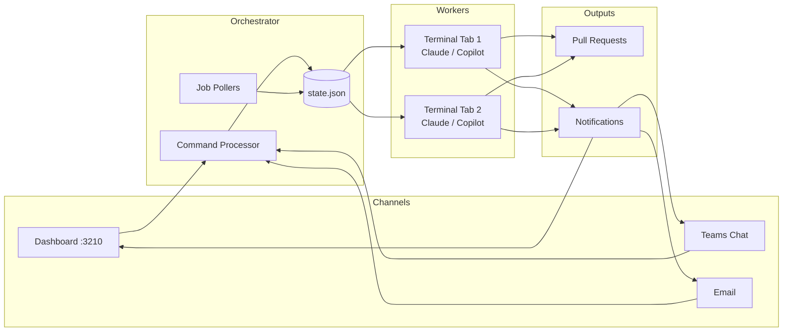

# Autotask

**Multi-agent task orchestrator that turns your development backlog into pull requests — autonomously.**

Autotask fetches open issues from your configured issue source (GitHub Issues, Linear, Jira, or a local file), spins up isolated AI workers in dedicated terminal tabs, and delivers tested PRs — all while keeping you in control through a live dashboard, Teams chat, or email.

## Why Autotask?

- **Hands-off, not eyes-off.** Workers run autonomously through the full lifecycle — workspace setup, build, code, test, PR — while you monitor progress from the Kanban dashboard, Teams, or your inbox.
- **Multi-channel command & control.** Issue commands from the dashboard UI, email, or Teams direct chat. Get notified the same way. No CLI session required.
- **Hybrid AI economics.** Route orchestration to cost-effective models (GitHub Copilot / GPT-5 mini) and reserve full-reasoning models (Claude Code) for complex coding phases. Or run everything on one platform — your choice.
- **Safe by design.** Hard-coded guardrails prevent workers from closing tasks (humans do that), force-pushing, or corrupting shared state. Hook-based enforcement, not trust-based.
- **Workspace isolation.** Each work item gets its own directory, branch, and build context. No cross-job contamination. Workspaces persist for inspection and reuse.
- **Pluggable issue sources.** Pull startable issues from GitHub Issues, Linear, Jira, or a local JSON file. Switch adapters with a single config line.

## Architecture



## Quick Start

**Prerequisites:** Node.js 18+, Bun, Git, Windows Terminal, and either [Claude Code](https://claude.ai/code) or [GitHub Copilot CLI](https://docs.github.com/en/copilot/github-copilot-in-the-cli).

```powershell
# 1. Clone and install
git clone https://github.com/your-org/autotask.git
cd autotask
.\setup\install.ps1

# 2. Edit your local config
# (the installer creates config.local.yaml from the template)
notepad config.local.yaml

# 3. Start the dashboard
npm install
pm2 start dashboard/ecosystem.config.js

# 4. Launch the orchestrator
#    From Claude Code or Copilot CLI:
/autotask-start
```

## Commands

| Command | Purpose |
|---------|---------|
| `/autotask-start` | Fetch issues from the configured source, select, and spawn workers |
| `/autotask-status` | Show queue, active workers, and completed jobs |
| `/autotask-queue` | Add a task to the waiting queue |
| `/autotask-continue` | Resume a completed or suspended task |
| `/autotask-wrapup` | End-of-day: verify PRs, save context, cleanup, summary |

All commands are also available from the dashboard command bar, email, and Teams chat. See the [User Guide](docs/user-guide.md) for the full command reference.

## Documentation

| Guide | Description |
|-------|-------------|
| [User Guide](docs/user-guide.md) | Daily workflow, configuration reference, autonomy modes |
| [Architecture Overview](docs/architecture-overview.md) | System components, worker lifecycle, data flows |
| [Teams Integration](docs/teams-guide.md) | Direct chat commands and notification setup |
| [Email Integration](docs/email-guide.md) | Email commands, polling, and notification templates |
| [Notifications](docs/notifications.md) | Event types, content fields, delivery channels |
| [Troubleshooting](docs/troubleshooting.md) | Diagnostics for dashboard, pollers, and workers |
| [Installation](setup/README.md) | Prerequisites, installer details, first-run options |

## License

Internal use only. Copyright WiseTech Global.
