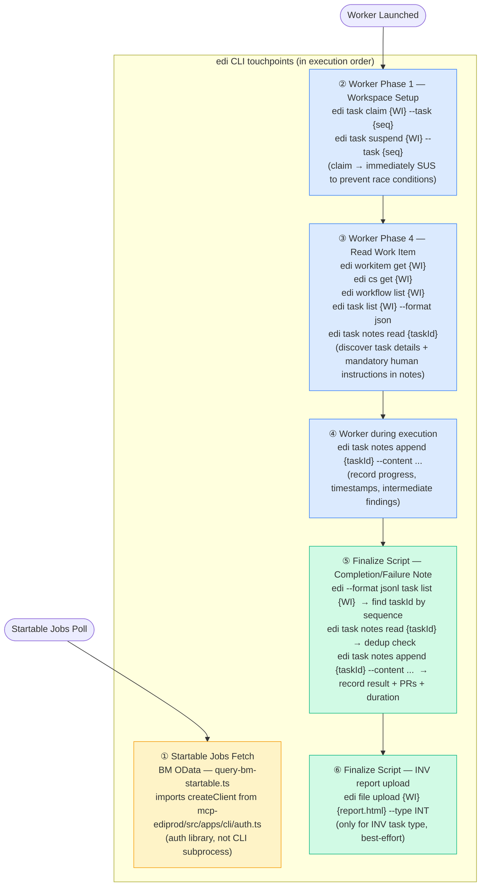
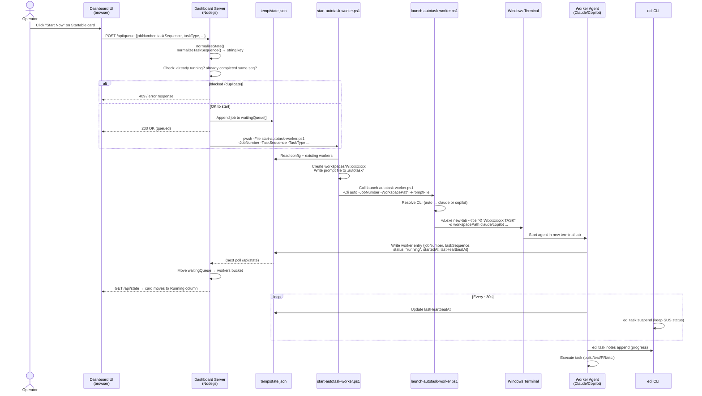
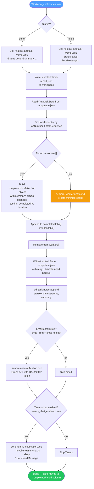
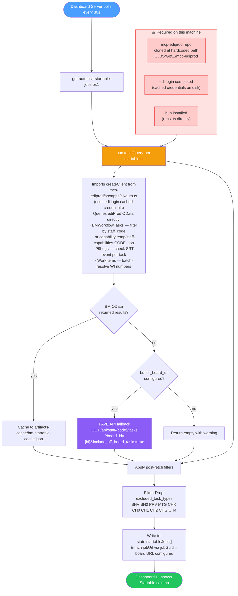
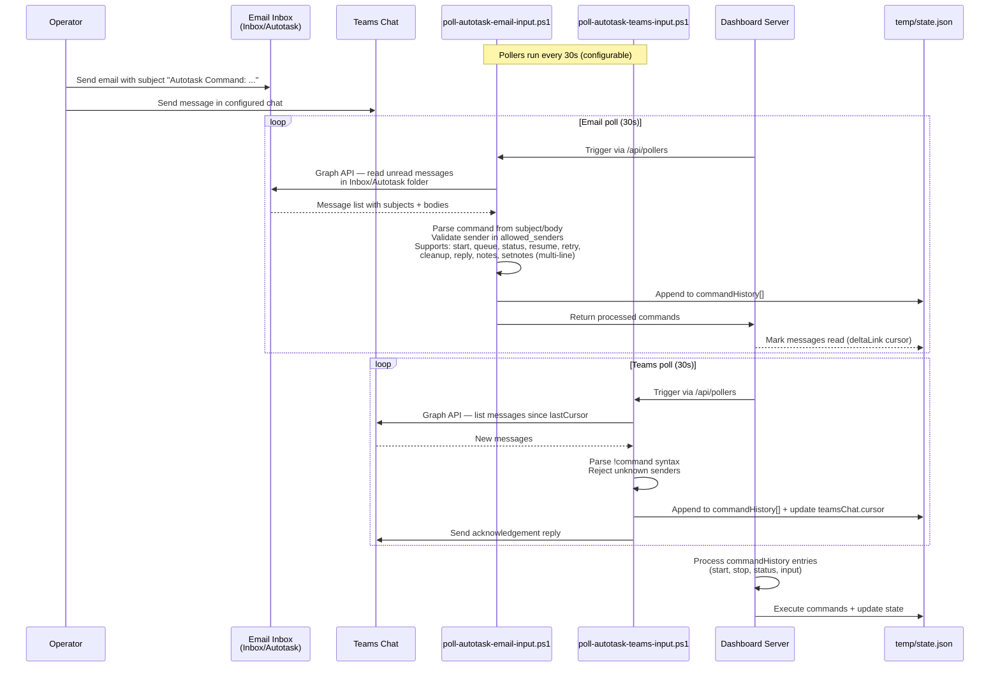
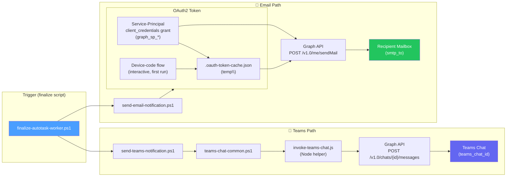
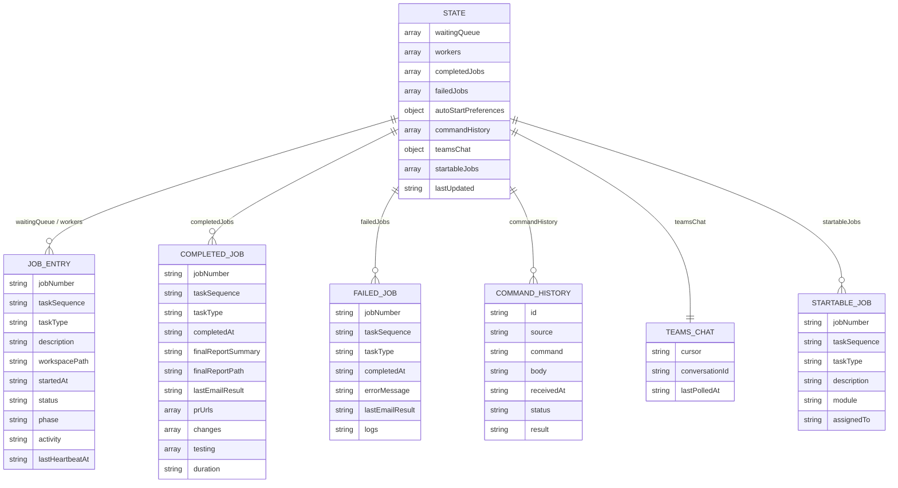
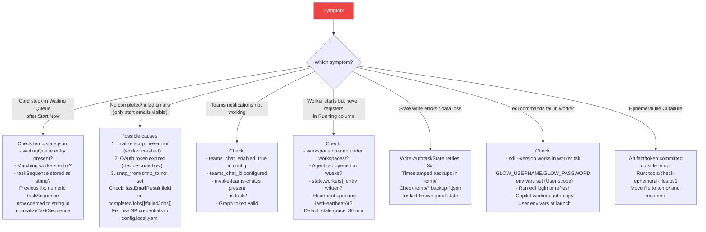

# Autotask System Architecture

> End-to-end reference for the Autotask multi-agent orchestrator. Covers components, data flows, worker lifecycle, notifications, and integrations.

---

## Table of Contents

1. [System Components](#1-system-components)
2. [Component Relationships](#2-component-relationships)
3. [edi CLI — Role Throughout the System](#3-edi-cli--role-throughout-the-system)
4. [Worker Start Flow (Sequence)](#4-worker-start-flow-sequence)
5. [Worker Lifecycle (State Machine)](#5-worker-lifecycle-state-machine)
6. [Worker Finalization Flow](#6-worker-finalization-flow)
7. [CLI Selection Logic](#7-cli-selection-logic)
8. [Startable Jobs Polling](#8-startable-jobs-polling)
9. [Command Intake (Email & Teams)](#9-command-intake-email--teams)
10. [Notification Flow (Email & Teams)](#10-notification-flow-email--teams)
11. [state.json Data Model](#11-statejson-data-model)
12. [Configuration Layering](#12-configuration-layering)
13. [Key Files Reference](#13-key-files-reference)
14. [Failure Modes & Debugging](#14-failure-modes--debugging)
15. [Operational Rules](#15-operational-rules)

---

## 1. System Components

| Component | Technology | Purpose |
|---|---|---|
| **Dashboard UI** | HTML/JS (browser) | Kanban view: Startable → Waiting → Running → Completed/Failed |
| **Dashboard Server** | Node.js (`dashboard/server.js`) | API server; reads/writes `temp\state.json`; spawns workers |
| **State Store** | JSON file (`temp\state.json`) | Authoritative runtime state — all buckets live here |
| **Start Script** | PowerShell (`tools\start-autotask-worker.ps1`) | Sets up workspace; resolves tasks; invokes launch script |
| **Launch Script** | PowerShell (`tools\launch-autotask-worker.ps1`) | Opens Windows Terminal tab; selects Claude or Copilot CLI |
| **Worker Agent** | Claude Code **or** Copilot CLI | Autonomous AI agent that executes the task end-to-end |
| **Finalize Script** | PowerShell (`tools\finalize-autotask-worker.ps1`) | Updates state; sends notifications; cleans up workspace |
| **edi CLI** | Bun/Node (`mcp-ediprod`) | Gate to ediProd: claim, suspend, notes, task queries |
| **Email Notifier** | PowerShell + Microsoft Graph | Sends start/complete/failed reports to configured mailbox |
| **Teams Notifier** | PowerShell + Graph + JS helper | Sends messages to configured Teams chat |
| **Poller: Startable Jobs** | PowerShell (`get-autotask-startable-jobs.ps1`) | Queries BM OData (primary) and PAVE API (fallback) for available tasks every 30 s |
| **Poller: Email Commands** | PowerShell (`poll-autotask-email-input.ps1`) | Reads Inbox/Autotask folder for operator commands |
| **Poller: Teams Commands** | PowerShell (`poll-autotask-teams-input.ps1`) | Reads Teams chat for operator commands |

---

## 2. Component Relationships


---

## 3. edi CLI — Role Throughout the System

The `edi` CLI (from the `mcp-ediprod` repo) is **not just a task management tool** — it is woven into every major phase of the Autotask pipeline. The sections below map each touchpoint.



### ① BM OData auth (library import)

`tools/query-bm-startable.ts` does **not** shell out to `edi`. It imports the auth layer directly from the mcp-ediprod TypeScript source:

```ts
import { createClient } from 'C:/BS/Git/GitHub/WiseTechGlobal/mcp-ediprod/src/apps/cli/auth.ts';
```

Requirements: mcp-ediprod cloned at that exact path + `edi login` cached + `bun` installed.

### ② Worker Phase 1 — claim & suspend

Immediately after the worker starts, it claims the task and **suspends it** to SUS status:

```
edi task claim {jobNumber} --task {taskSequence}
edi task suspend {jobNumber} --task {taskSequence} --reason "Claimed by {staffCode} for Autotask work"
```

This prevents other engineers from accidentally picking up the same task.

### ③ Worker Phase 4 — read work item

The worker reads everything it needs from ediProd before starting design/coding:

```
edi workitem get {jobNumber}          # full WI details + acceptance criteria
edi cs get {jobNumber}                # for CS incident tickets
edi workflow list {jobNumber}         # workflow task breakdown
edi task list {jobNumber} --format json   # find taskId matching taskSequence
edi task notes read {taskId}          # ⚠️ MANDATORY: notes may contain human instructions
```

> Task notes are treated with the **same authority as the work item description**. Any instructions, constraints, or context left by a human or previous run in task notes are mandatory inputs to the design plan.

### ④ Worker progress notes

Throughout execution the worker appends timestamped progress notes:

```
edi task notes append {taskId} --content "[NTR] Started: 2026-04-10T05:00Z — planning phase"
edi task notes append {taskId} --content "[NTR] Code complete — building tests"
```

### ⑤ Finalize script — completion/failure note

`finalize-autotask-worker.ps1` always appends a final note (with deduplication guard):

```
edi --format jsonl task list {jobNumber}   # locate taskId by sequence number
edi task notes read {taskId}              # check if completion marker already exists
edi task notes append {taskId} --content "[NTR] Completed: 2026-04-10T06:00Z (Autotask, 1h 2m)<br>{summary}<br>PRs: {urls}"
```

### ⑥ Finalize script — INV report upload

For `INV` task type only, the finalize script uploads any `*report*.html` files to ediProd:

```
edi file upload {jobNumber} {workspace}/*report*.html --type INT
```

---

## 4. Worker Start Flow (Sequence)



---

## 5. Worker Lifecycle (State Machine)

```mermaid
stateDiagram-v2
    [*] --> Startable : edi CLI / PAVE poller discovers task

    Startable --> WaitingQueue : "Operator clicks Start Now<br/>(POST /api/queue)"

    WaitingQueue --> Running : "start script spawns agent;<br/>agent writes state.workers entry"

    Running --> Running : "heartbeat updates every ~30s"

    Running --> NeedsInput : "agent writes userInputRequest<br/>to state.json"

    NeedsInput --> Running : "operator submits input<br/>(POST /api/submit-input or Teams/email command)"

    Running --> Completed : "finalize-autotask-worker.ps1<br/>-Status done"

    Running --> Failed : "finalize-autotask-worker.ps1<br/>-Status failed<br/>OR worker process crashes / stale heartbeat"

    Completed --> [*] : "card visible in Completed column;<br/>notifications sent"

    Failed --> [*] : "card visible in Failed column;<br/>error notifications sent"

    Failed --> WaitingQueue : "Operator clicks Retry<br/>(POST /api/queue -Mode retry)"

    note right of Running
        state.workers[]
        jobNumber, taskSequence,
        workspacePath, startedAt,
        lastHeartbeatAt, status,
        phase, activity
    end note

    note right of Completed
        state.completedJobs[]
        completedAt, finalReportSummary,
        finalReportPath, lastEmailResult,
        prUrls, changes, testing
    end note
```



---

## 6. Worker Finalization Flow



---

## 7. CLI Selection Logic


---

## 8. Startable Jobs Polling

### Prerequisites for BM OData

> ⚠️ **Critical dependency:** `query-bm-startable.ts` does **not** shell out to `edi`. It imports the auth layer **directly from the mcp-ediprod source**:
> ```ts
> import { createClient } from 'C:/BS/Git/GitHub/WiseTechGlobal/mcp-ediprod/src/apps/cli/auth.ts';
> ```
> This means **all three of the following must be true** or BM OData fetching will fail entirely and fall back to PAVE API (or return empty):
> 1. **`mcp-ediprod` repo cloned** at `C:/BS/Git/GitHub/WiseTechGlobal/mcp-ediprod`
> 2. **`edi login` completed** — cached credentials must be present on disk
> 3. **`bun` installed** — the script is run as `bun tools/query-bm-startable.ts` (TypeScript executed directly; node/npm cannot substitute)



> **Note:** `edi workitem list` is **not** used in the startable-jobs fetch path. BM OData is always queried directly via `bun tools/query-bm-startable.ts`. The PAVE API is used as an automatic fallback only when BM OData returns no results.

---

## 9. Command Intake (Email & Teams)



---

## 10. Notification Flow (Email & Teams)



---

## 11. state.json Data Model



---

## 12. Configuration Layering


---

## 13. Key Files Reference

| Path | Role |
|---|---|
| `dashboard/server.js` | API server, state normalization, start-flow logic, bucket routing |
| `dashboard/index.html` | Kanban UI — `refreshState()`, `detectChanges()`, card rendering |
| `temp/state.json` | **Runtime state** — authoritative source for all buckets (gitignored) |
| `config.yaml` | Base config (committed) |
| `config.local.yaml` | Machine config overrides (gitignored) |
| `config.local.yaml.template` | Template for new installs |
| `tools/start-autotask-worker.ps1` | Worker bootstrap: creates workspace, writes prompt, calls launch |
| `tools/launch-autotask-worker.ps1` | Resolves CLI; opens `wt.exe` tab for Claude or Copilot |
| `tools/finalize-autotask-worker.ps1` | End-of-job: state update, edi notes, notifications, cleanup |
| `tools/autotask-state-common.ps1` | `Read-AutotaskState` / `Write-AutotaskState` with retries + backups |
| `tools/get-autotask-startable-jobs.ps1` | Fetches available tasks from edi CLI or PAVE board |
| `tools/send-email-notification.ps1` | Graph API email with OAuth2/SP, 3-retry + exponential backoff |
| `tools/send-teams-notification.ps1` | Teams direct-chat via Graph (webhook path removed) |
| `tools/invoke-teams-chat.js` | Node.js helper for Graph `/chats/{id}/messages` |
| `tools/teams-chat-common.ps1` | Shared Teams auth + message helpers |
| `tools/poll-autotask-email-input.ps1` | Polls Inbox/Autotask for operator commands |
| `tools/poll-autotask-teams-input.ps1` | Polls Teams chat for operator commands |
| `agents/task-worker.md` | System prompt / instructions given to every worker agent |
| `setup/install.ps1` | Interactive installer — requires **pwsh 7+** |
| `docs/edi-cli.md` | edi CLI quick reference + install steps |

---

## 14. Failure Modes & Debugging



---

## 15. Operational Rules

> **Hard rules — no exceptions.**

| Rule | Reason |
|---|---|
| ✅ `edi task suspend` — permitted | Puts task in SUS; safe to use freely |
| ✅ `edi task claim` → immediately `edi task suspend` | Prevents race conditions with other engineers |
| ✅ `edi task notes append` | Safe audit trail for start/end times |
| ❌ `edi task start` — **NEVER** | Sets WRK status; causes race conditions |
| ❌ `edi task complete` — **NEVER** | Sets CLS status; humans close tasks manually |
| ✅ All temp files go in `temp/` | gitignored; CI enforces via `check-ephemeral-files.ps1` |
| ✅ `pwsh` 7+ required | `setup/install.ps1` enforced with `#Requires -Version 7.0` |
