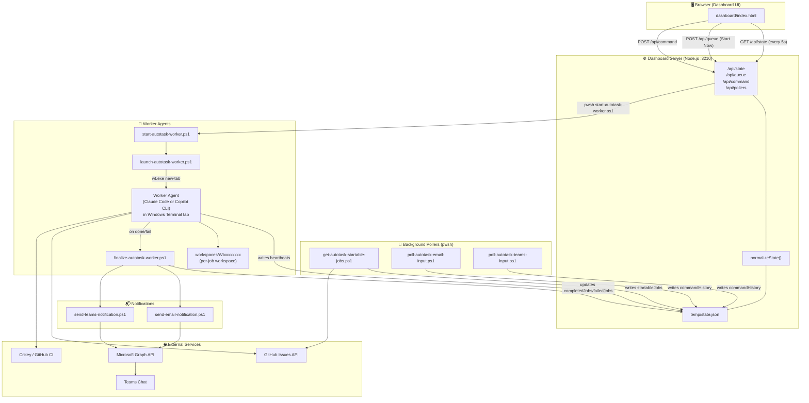
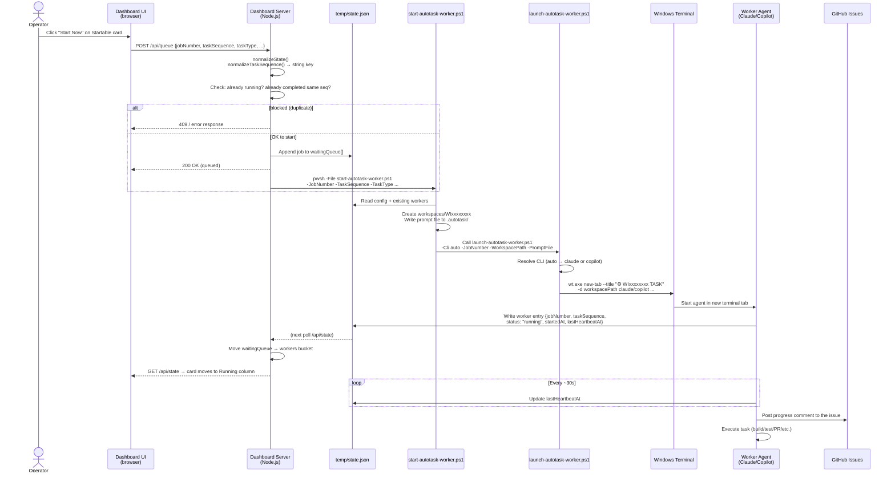
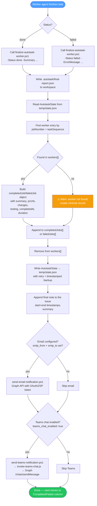
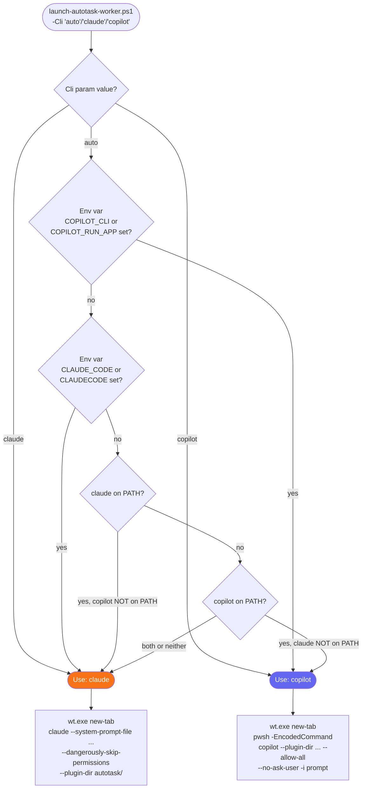
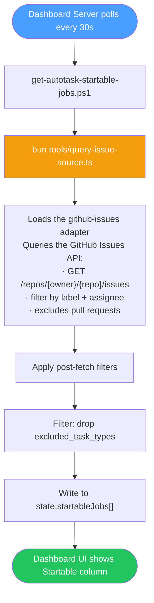
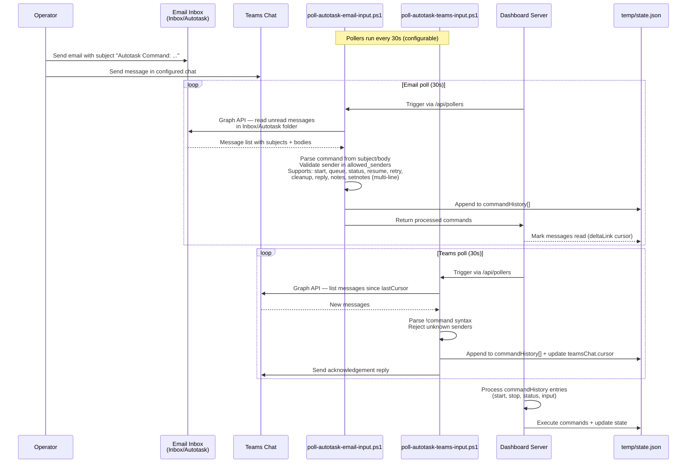
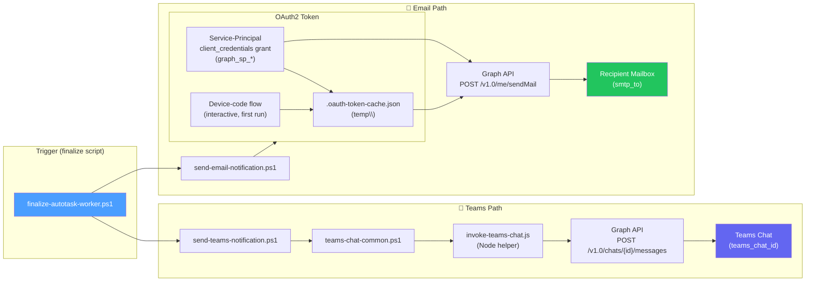
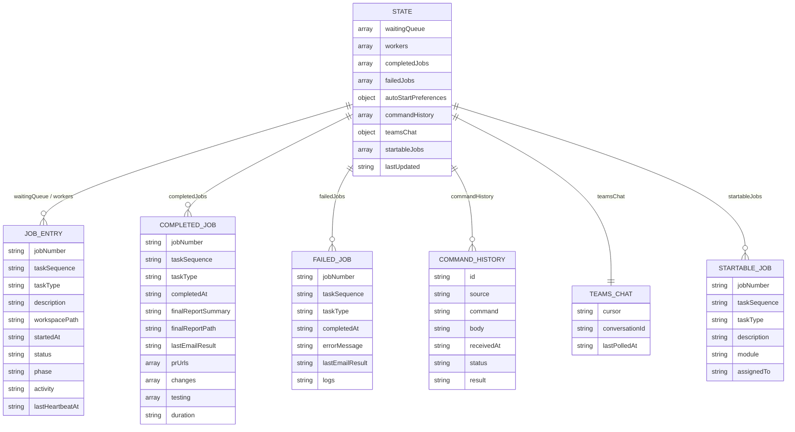
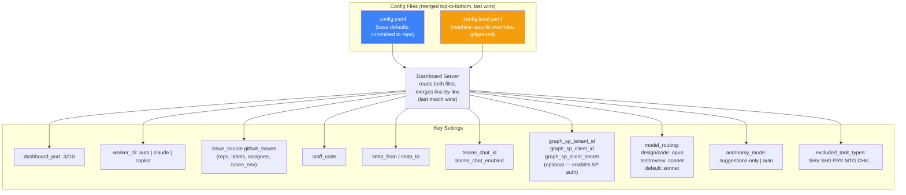
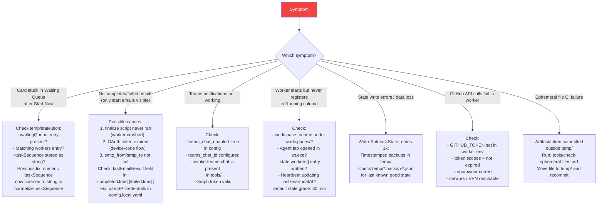

# Autotask System Architecture

> End-to-end reference for the Autotask multi-agent orchestrator. Covers components, data flows, worker lifecycle, notifications, and integrations.

---

## Table of Contents

1. [System Components](#1-system-components)
2. [Component Relationships](#2-component-relationships)
3. [Issue Source Integration](#3-issue-source-integration)
4. [Worker Start Flow (Sequence)](#4-worker-start-flow-sequence)
5. [Worker Lifecycle (State Machine)](#5-worker-lifecycle-state-machine)
6. [Worker Finalization Flow](#6-worker-finalization-flow)
7. [CLI Selection Logic](#7-cli-selection-logic)
8. [Startable Jobs Polling](#8-startable-jobs-polling)
9. [Command Intake (Email & Teams)](#9-command-intake-email--teams)
10. [Notification Flow (Email & Teams)](#10-notification-flow-email--teams)
11. [state.json Data Model](#11-statejson-data-model)
12. [Configuration Layering](#12-configuration-layering)
13. [Key Files Reference](#13-key-files-reference)
14. [Failure Modes & Debugging](#14-failure-modes--debugging)
15. [Operational Rules](#15-operational-rules)

---

## 1. System Components

| Component | Technology | Purpose |
|---|---|---|
| **Dashboard UI** | HTML/JS (browser) | Kanban view: Startable → Waiting → Running → Completed/Failed |
| **Dashboard Server** | Node.js (`dashboard/server.js`) | API server; reads/writes `temp\state.json`; spawns workers |
| **State Store** | JSON file (`temp\state.json`) | Authoritative runtime state — all buckets live here |
| **Start Script** | PowerShell (`tools\start-autotask-worker.ps1`) | Sets up workspace; resolves tasks; invokes launch script |
| **Launch Script** | PowerShell (`tools\launch-autotask-worker.ps1`) | Opens Windows Terminal tab; selects Claude or Copilot CLI |
| **Worker Agent** | Claude Code **or** Copilot CLI | Autonomous AI agent that executes the task end-to-end |
| **Finalize Script** | PowerShell (`tools\finalize-autotask-worker.ps1`) | Updates state; sends notifications; cleans up workspace |
| **Email Notifier** | PowerShell + Microsoft Graph | Sends start/complete/failed reports to configured mailbox |
| **Teams Notifier** | PowerShell + Graph + JS helper | Sends messages to configured Teams chat |
| **Poller: Startable Jobs** | PowerShell (`get-autotask-startable-jobs.ps1`) | Queries the configured issue source (GitHub Issues) for available tasks every 30 s |
| **Poller: Email Commands** | PowerShell (`poll-autotask-email-input.ps1`) | Reads Inbox/Autotask folder for operator commands |
| **Poller: Teams Commands** | PowerShell (`poll-autotask-teams-input.ps1`) | Reads Teams chat for operator commands |

---

## 2. Component Relationships

---

## 3. Issue Source Integration

Autotask interacts with the configured issue source (GitHub Issues) through the
`issue-source` adapter at each major phase of the pipeline:

| Phase | Adapter touchpoint |
|-------|--------------------|
| **Startable jobs fetch** | `fetchStartable` — `get-autotask-startable-jobs.ps1` → `query-issue-source.ts` (github-issues adapter) lists open issues filtered by label/assignee |
| **Worker claim** | `claim` — marks the issue as in-progress (status label) when work begins |
| **Worker read** | the worker reads the issue title, body, and comments for task details and any human instructions |
| **Progress / completion notes** | `appendNote` — posts progress and final result (summary + PR links) as issue comments |
| **Status updates** | `updateStatus` — moves the issue through its lifecycle status labels |

> Issue comments are treated with the **same authority as the issue description**. Any instructions, constraints, or context left by a human or previous run are mandatory inputs to the design plan.

---

## 4. Worker Start Flow (Sequence)

---

## 5. Worker Lifecycle (State Machine)

---

## 6. Worker Finalization Flow

---

## 7. CLI Selection Logic

---

## 8. Startable Jobs Polling

### Prerequisites for the GitHub Issues fetch

> ⚠️ **Required config:** the startable poller fetches through `tools/query-issue-source.ts` (the `github-issues` adapter). For it to return results:
> 1. **`issue_source.github_issues.repo`** set to `owner/repo`
> 2. **GitHub token** present in the configured env var (`token_env`, default `GITHUB_TOKEN`)
> 3. **`bun` installed** — the script is run as `bun tools/query-issue-source.ts`

---

## 9. Command Intake (Email & Teams)

---

## 10. Notification Flow (Email & Teams)

---

## 11. state.json Data Model

---

## 12. Configuration Layering

---

## 13. Key Files Reference

| Path | Role |
|---|---|
| `dashboard/server.js` | API server, state normalization, start-flow logic, bucket routing |
| `dashboard/index.html` | Kanban UI — `refreshState()`, `detectChanges()`, card rendering |
| `temp/state.json` | **Runtime state** — authoritative source for all buckets (gitignored) |
| `config.yaml` | Base config (committed) |
| `config.local.yaml` | Machine config overrides (gitignored) |
| `config.local.yaml.template` | Template for new installs |
| `tools/start-autotask-worker.ps1` | Worker bootstrap: creates workspace, writes prompt, calls launch |
| `tools/launch-autotask-worker.ps1` | Resolves CLI; opens `wt.exe` tab for Claude or Copilot |
| `tools/finalize-autotask-worker.ps1` | End-of-job: state update, issue notes, notifications, cleanup |
| `tools/autotask-state-common.ps1` | `Read-AutotaskState` / `Write-AutotaskState` with retries + backups |
| `tools/get-autotask-startable-jobs.ps1` | Fetches available tasks from the configured issue source (GitHub Issues) |
| `tools/send-email-notification.ps1` | Graph API email with OAuth2/SP, 3-retry + exponential backoff |
| `tools/send-teams-notification.ps1` | Teams direct-chat via Graph (webhook path removed) |
| `tools/invoke-teams-chat.js` | Node.js helper for Graph `/chats/{id}/messages` |
| `tools/teams-chat-common.ps1` | Shared Teams auth + message helpers |
| `tools/poll-autotask-email-input.ps1` | Polls Inbox/Autotask for operator commands |
| `tools/poll-autotask-teams-input.ps1` | Polls Teams chat for operator commands |
| `agents/task-worker.md` | System prompt / instructions given to every worker agent |
| `setup/install.ps1` | Interactive installer — requires **pwsh 7+** |

---

## 14. Failure Modes & Debugging

---

## 15. Operational Rules

> **Hard rules — no exceptions.**

| Rule | Reason |
|---|---|
| ❌ Never close issues from automation | Humans close issues manually after review |
| ✅ All temp files go in `temp/` | gitignored; CI enforces via `check-ephemeral-files.ps1` |
| ✅ `pwsh` 7+ required | `setup/install.ps1` enforced with `#Requires -Version 7.0` |
