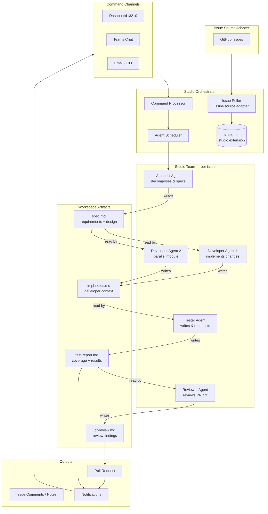

# Autotask Studio — Architecture Design

> Transform Autotask from a single-worker task automator into a **multi-agent software development studio**: a collaborative team of specialized AI agents that together take a work item from requirements through design, implementation, testing, and review.

---

## Table of Contents

1. [Vision & Goals](#1-vision--goals)
2. [What Changes](#2-what-changes)
3. [Studio Architecture](#3-studio-architecture)
4. [Agent Roles](#4-agent-roles)
5. [Agent Collaboration Model](#5-agent-collaboration-model)
6. [Issue Source Abstraction (Generic Backends)](#6-issue-source-abstraction-generic-backends)
7. [State Model Changes](#7-state-model-changes)
8. [Configuration Changes](#8-configuration-changes)
9. [New Commands](#9-new-commands)
10. [File & Folder Changes](#10-file--folder-changes)
11. [Migration Path](#11-migration-path)
12. [Open Questions](#12-open-questions)

---

## 1. Vision & Goals

**Goal**: A generic, self-organizing AI development studio that picks up an issue, assembles a small team of specialized agents, and delivers a reviewed, tested PR — with no assumptions about WiseTech infrastructure.

### Principles

| Principle | Description |
|-----------|-------------|
| **Generic by default** | Works out of the box with GitHub Issues. No proprietary system required. |
| **Specialization over generalism** | Each agent has a focused role and focused prompts. The architect does not write tests; the tester does not design architecture. |
| **Handoff-driven** | Agents communicate through shared **artifacts** (spec docs, code, test reports) stored in the workspace. No shared mutable state between agents. |
| **Human gates** | The studio pauses at configurable quality gates (after design, after PR creation) for human approval before proceeding. |
| **Drop-in orchestrators** | The current single-worker path still works. Studio mode is opt-in per issue type or globally via config. |

---

## 2. What Changes

### Removed (WTG-specific)

| Removed | Replacement |
|---------|-------------|
| `ediProd` task tracking | Generic "issue tracker" plugin interface |
| `edi task claim/suspend/notes` calls | `issue-tracker` adapter methods: `claim`, `update_status`, `append_note` |
| BM OData + PAVE API job discovery | `issue-source` adapter: GitHub Issues |
| `Crikey` artifact download | Generic `artifact-cache` adapter (CI system agnostic) |
| `CargoWise` / WTG repo mapping | User-defined `repo_groups` in config |
| VPN preflight to `crikey.wtg.zone` | Generic `preflight_checks` list in config |
| `mcp-ediprod` MCP server | Removed. Replaced by issue tracker adapter calls |
| `staff_code` / `buffer_board_url` | Generic `studio.staff_id` and issue source config |

### Added (Studio-specific)

| Added | Purpose |
|-------|---------|
| **Architect agent** | Decomposes requirements, drafts a solution spec |
| **Developer agent(s)** | Implements code changes per spec |
| **Tester agent** | Writes unit/integration tests, runs them, reports coverage |
| **Reviewer agent** | Reviews the PR diff, suggests improvements, approves or requests changes |
| **Handoff artifacts** | Shared Markdown/JSON files in the workspace that agents pass to each other |
| **Studio orchestrator** | Coordinates agent sequencing, parallelization, and gates |
| **Issue source adapter API** | Pluggable interface for fetching and managing issues |
| **`studio-start` command** | New orchestrator entry point for studio mode |

---

## 3. Studio Architecture



---

## 4. Agent Roles

Each role is a separate agent definition file (`agents/<role>.md`) with its own system prompt, tool allowlist, and model tier.

### 4.1 Architect Agent (`agents/architect.md`)

**Trigger**: First agent invoked when a new issue is claimed.

**Inputs**:

- Issue title, description, acceptance criteria
- Relevant repo paths (read-only reference)
- Previous `spec.md` if resuming

**Responsibilities**:

1. Read the issue thoroughly
2. Explore the relevant codebase (grep, read, LSP)
3. Identify affected modules, entry points, and risk areas
4. Draft `spec.md`:
   - Problem statement
   - Proposed solution approach
   - Files likely to change (with rationale)
   - Sub-tasks (can be handed to parallel developers)
   - Test strategy
   - Out-of-scope items
5. Write `spec.md` to the workspace
6. Update issue status to "in-design" via issue tracker adapter

**Gate**: Human reviews `spec.md` if `autonomy_mode: suggestions-only` (default). Studio waits for approval before proceeding to developers.

**Model tier**: `design` (default: `opus` / highest reasoning)

**Does NOT**: Write code, run builds, create branches.

---

### 4.2 Developer Agent (`agents/developer.md`)

**Trigger**: After `spec.md` is approved (or auto-approved in `auto` mode).

**Inputs**:

- `spec.md` (full design)
- Assigned sub-task from spec (supports parallel instances)
- Workspace clone (already set up by orchestrator)

**Responsibilities**:

1. Read `spec.md` and assigned sub-task
2. Clone repos if not already present, create branch
3. Implement the changes
4. Write `impl-notes.md` — documents decisions made, non-obvious choices, anything the tester or reviewer should know
5. Run a quick smoke build (compile only, no full test suite) to catch obvious breaks
6. Signal completion to orchestrator

**Multiple instances**: The orchestrator can spawn 2–3 developer agents on different sub-tasks if `spec.md` partitions the work. Each gets its own sub-workspace.

**Model tier**: `code` (default: `opus`)

**Does NOT**: Write tests (that's the tester), review its own work, create the PR.

---

### 4.3 Tester Agent (`agents/tester.md`)

**Trigger**: After all developer agents complete.

**Inputs**:

- `spec.md` (test strategy section)
- `impl-notes.md` from each developer
- Merged workspace code

**Responsibilities**:

1. Read the test strategy from `spec.md`
2. Write new unit/integration tests for changed logic
3. Run the full test suite
4. Record results in `test-report.md`:
   - Tests added
   - Tests passing/failing
   - Coverage delta (if measurable)
   - Any flakiness observed
5. If tests fail: attempt one round of fixes, then escalate to orchestrator if still failing
6. Update issue with test summary via issue tracker adapter

**Model tier**: `test` (default: `sonnet`)

**Does NOT**: Change production code, create the PR.

---

### 4.4 Reviewer Agent (`agents/reviewer.md`)

**Trigger**: After tester agent completes without blocking failures.

**Inputs**:

- `spec.md`
- `impl-notes.md`
- `test-report.md`
- Full PR diff (generated by orchestrator before invoking reviewer)

**Responsibilities**:

1. Read all artifacts
2. Review the PR diff against the spec:
   - Correctness — does it do what the spec says?
   - Completeness — are there missing pieces?
   - Code quality — obvious anti-patterns, security issues, readability
   - Test adequacy — does the test-report show meaningful coverage?
3. Write `pr-review.md`:
   - Overall verdict: `approve` / `request-changes` / `escalate`
   - Inline comments (file + line + comment)
   - Summary for the PR description
4. If verdict is `approve`: orchestrator posts the PR and notifies the user
5. If verdict is `request-changes`: findings are fed back to the developer agent for a revision cycle (max `review_cycles` from config)
6. If verdict is `escalate`: orchestrator pauses and notifies the human

**Model tier**: `review` (default: `sonnet`)

**Does NOT**: Write code, run tests.

---

### 4.5 Orchestrator (enhanced `autotask-start` / `studio-start`)

The orchestrator is not a separate AI agent — it is the human-readable playbook (`commands/studio-start.md`) executed by the active CLI (Claude or Copilot). It:

- Polls for new issues via the configured issue source adapter
- Selects and claims issues
- Sets up the workspace
- Spawns agents in order (architect → developer(s) → tester → reviewer)
- Checks handoff artifacts before triggering the next agent
- Enforces gates (pause for human approval when configured)
- Posts the final PR and sends notifications

---

## 5. Agent Collaboration Model

Agents collaborate **asynchronously** through workspace files, not by calling each other directly. This keeps agents decoupled and allows humans to inspect or edit handoff artifacts between stages.

### Handoff Artifacts

All artifacts live in `workspaces/<issue-id>/studio/`:

```
workspaces/<issue-id>/
  studio/
    spec.md           ← Architect output; Developer + Tester input
    impl-notes.md     ← Developer output; Tester + Reviewer input
    test-report.md    ← Tester output; Reviewer input
    pr-review.md      ← Reviewer output; Orchestrator input
    handoff.json      ← Machine-readable status for each stage
  <repo1>/            ← Cloned repos (unchanged from current)
  <repo2>/
```

### `handoff.json` Schema

```json
{
  "issue": "GH-123",
  "stages": {
    "architect":  { "status": "completed", "completedAt": "2026-04-15T10:00:00Z" },
    "developer":  { "status": "completed", "completedAt": "2026-04-15T11:30:00Z", "subtasks": ["st-1", "st-2"] },
    "tester":     { "status": "in-progress", "startedAt": "2026-04-15T11:32:00Z" },
    "reviewer":   { "status": "pending" }
  },
  "gate": {
    "name": "post-design",
    "status": "approved",
    "approvedBy": "human",
    "approvedAt": "2026-04-15T10:05:00Z"
  },
  "reviewCycles": 0,
  "maxReviewCycles": 2
}
```

### Revision Cycle

```
Developer → Tester → Reviewer
                        ↓ request-changes
                     Developer (revision)
                        ↓
                     Tester (rerun)
                        ↓
                     Reviewer (re-review)
                        ↓ approve
                     Orchestrator (post PR)
```

Max cycles controlled by `review_cycles` config key (default: 2). After exhausting cycles, escalate to human.

---

## 6. Issue Source Abstraction (Generic Backends)

Replace the WTG-specific job discovery with a pluggable adapter interface.

### Adapter Interface (conceptual)

Each adapter is a TypeScript module in `adapters/issue-sources/` that implements:

```typescript
interface IssueSourceAdapter {
  // Fetch issues ready to be worked on
  fetchStartable(config: StudioConfig): Promise<Issue[]>;

  // Claim an issue (assign to self, mark in-progress)
  claim(issueId: string, config: StudioConfig): Promise<void>;

  // Append a note/comment to the issue
  appendNote(issueId: string, note: string, config: StudioConfig): Promise<void>;

  // Update the issue status label
  updateStatus(issueId: string, status: IssueStatus, config: StudioConfig): Promise<void>;
}
```

### Built-in Adapters

| Adapter | Source | Notes |
|---------|--------|-------|
| `github-issues` | GitHub Issues API | Filter by label, milestone, or project board column |

### Configuration (per adapter)

```yaml
issue_source:
  adapter: github-issues       # adapter name
  github_issues:
    repo: owner/repo
    labels: ["ready-for-dev"]
    assignee: me               # only issues assigned to self
    token_env: GITHUB_TOKEN    # env var name for auth token
  polling_interval_ms: 60000
```

---

## 7. State Model Changes

Extend `temp/state.json` with a `studio` section per running job.

### New `studioTeam` field on workers

```json
{
  "workers": [
    {
      "jobNumber": "GH-123",
      "studioTeam": {
        "enabled": true,
        "activeAgent": "tester",
        "stages": {
          "architect":  "completed",
          "developer":  "completed",
          "tester":     "in-progress",
          "reviewer":   "pending"
        },
        "artifactsPath": "workspaces/GH-123/studio",
        "reviewCycles": 0
      }
    }
  ]
}
```

### Dashboard changes

The Kanban dashboard gains a new "Studio Team" column view showing per-stage progress when `studioTeam.enabled` is true:

```
[GH-123]  Architect ✓  Developer ✓  Tester ⚙  Reviewer ○
```

---

## 8. Configuration Changes

### `config.yaml` changes (additions)

```yaml
# Studio mode
studio:
  enabled: false                  # set true to enable multi-agent studio
  autonomy_mode: suggestions-only # suggestions-only | auto
  review_cycles: 2                # max developer revision cycles
  gates:
    post_design: true             # pause for human after spec.md
    post_pr: true                 # pause for human before merging

# Issue source (replaces buffer_board_url + edi-specific config)
issue_source:
  adapter: github-issues
  polling_interval_ms: 60000

# Model routing (unchanged keys, new defaults)
model_routing:
  design: "opus"
  code: "opus"
  test: "sonnet"
  review: "sonnet"
  triage: "sonnet"
  default: "sonnet"

# Repo groups (replaces WTG product_repo_mapping)
repo_groups:
  backend:
    - my-api
    - my-db-migrations
  frontend:
    - my-web-app

# Build commands per repo (replaces Crikey-specific artifact logic)
build:
  commands:
    my-api: "dotnet build"
    my-web-app: "npm run build"
  test_commands:
    my-api: "dotnet test"
    my-web-app: "npm test"
```

### `config.yaml` keys removed

```yaml
# REMOVED — WTG-specific
buffer_board_url
crikey_base_url
crikey_target_repo
crikey_default_branch
crikey_build_config
artifacts_max_cached
vpn_check_host
product_repo_mapping
bin_target_repo
bin_copy_sources
db_upgrade
mcp_ediprod_root
domain_plugins  # moved to optional plugins section
staff_capabilities
excluded_task_types
startable_jobs_fallback_mode
startable_jobs_fallback_on_empty
```

---

## 9. New Commands

| Command | File | Purpose |
|---------|------|---------|
| `studio-start` | `commands/studio-start.md` | Studio orchestrator — polls issues, runs full agent pipeline |
| `studio-status` | `commands/studio-status.md` | Per-stage progress view (extends `autotask-status`) |
| `studio-review` | `commands/studio-review.md` | Show `spec.md` or `pr-review.md` for human gate approval |
| `studio-approve` | (dashboard / Teams / email) | Approve a gate and let the pipeline continue |

Existing commands (`autotask-start`, `autotask-status`, etc.) remain as legacy single-worker paths (still functional, now labeled as "solo mode").

---

## 10. File & Folder Changes

### New files

```
adapters/
  issue-sources/
    github-issues.ts    ← GitHub Issues adapter
    index.ts            ← Adapter loader

agents/
  architect.md          ← Architect agent definition
  developer.md          ← Developer agent definition
  tester.md             ← Tester agent definition
  reviewer.md           ← Reviewer agent definition
  (task-worker.md kept as legacy solo-mode agent)

commands/
  studio-start.md       ← New orchestrator playbook
  studio-status.md
  studio-review.md

tools/
  launch-studio-team.ps1     ← Spawns multiple agent tabs for a studio session
  finalize-studio-session.ps1 ← Collects artifacts, posts PR, sends notifications

workspaces/<issue-id>/
  studio/
    spec.md
    impl-notes.md
    test-report.md
    pr-review.md
    handoff.json
```

### Modified files

| File | Change |
|------|--------|
| `config.yaml` | Add `studio.*`, `issue_source.*`, `repo_groups`, `build.*`; remove WTG keys |
| `config.local.yaml.template` | Update to reflect new generic schema |
| `temp/state.json` | Extended schema — add `studioTeam` per worker |
| `dashboard/server.js` | Add studio stage rendering; adapt issue source display |
| `dashboard/index.html` | Add per-stage progress bar in Kanban card |
| `tools/start-autotask-worker.ps1` | Add `--studio` flag; conditionally invoke studio pipeline |
| `tools/get-autotask-startable-jobs.ps1` | Refactor to call issue source adapter |
| `README.md` | Update to reflect studio mode |
| `AGENTS.md` / `CLAUDE.md` | Update agent catalog and key paths |

### Files to retire (or thin down)

| File | Disposition |
|------|-------------|
| `tools/ediProd-mcp-server.js` | Move to `adapters/issue-sources/ediprod.ts` (optional plugin) |
| `hooks/guard-mcp-ediprod-task.ps1` | Retire (ediProd-specific) |
| `hooks/guard-bash-edi-task.ps1` | Retire (ediProd-specific) |
| `tools/get-autotask-task-notes.ps1` | Generalize into issue tracker adapter |
| `tools/set-autotask-task-notes.ps1` | Generalize |
| `skills/crikey-build-artifacts/` | Move to optional `plugins/crikey/` (still usable for WTG) |

---

## 11. Migration Path

Studio mode is **additive** — the existing single-worker pipeline continues to work unchanged. Migration happens in phases:

### Phase 1 — Adapter layer (no breakage)

1. Create `adapters/issue-sources/` with all adapters
2. Update `get-autotask-startable-jobs.ps1` to route through the adapter
3. Add `issue_source` config key; keep `buffer_board_url` as deprecated alias
4. Add `repo_groups` and `build.commands` to config; keep old WTG keys as deprecated

### Phase 2 — Agent definitions

1. Write `agents/architect.md`, `developer.md`, `tester.md`, `reviewer.md`
2. Write `commands/studio-start.md` orchestrator playbook
3. Write `tools/launch-studio-team.ps1`
4. Extend `state.json` schema (backward-compatible — new fields only)

### Phase 3 — Dashboard update

1. Add studio stage columns to dashboard cards
2. Add gate approval UI (approve button on cards with pending gates)
3. Wire studio-approve command through all channels

### Phase 4 — WTG cleanup (optional, WTG users only)

1. Move ediProd logic to `adapters/issue-sources/ediprod.ts`
2. Retire WTG-specific hooks
3. Remove deprecated config keys

---

## 12. Open Questions

| # | Question | Options |
|---|----------|---------|
| Q1 | When should developer agents parallelize vs. serialize? | Always serialize (safer), or opt-in parallel when spec explicitly partitions tasks |
| Q2 | How should the reviewer agent post inline comments to GitHub? | Use `gh pr review --comment`, or write a comment file and let the orchestrator post via GitHub API |
| Q3 | Should the tester agent also run linters and static analysis, or is that a separate `linter` agent? | Combine into tester for simplicity initially, split later if prompts get too large |
| Q4 | What is the human UX for gate approval? | Dashboard button is clearest; Teams message reply also good; email approval also needed |
| Q5 | How to handle monorepos where architect, developer, and tester all need the same clone? | Single shared workspace clone per repo; agents coordinate via handoff.json to avoid simultaneous git ops |
| Q6 | Should each agent role spin up a dedicated Windows Terminal tab, or run sequentially in one tab? | Sequential in one tab (simpler, fewer open terminals); parallel agents each get their own tab |
